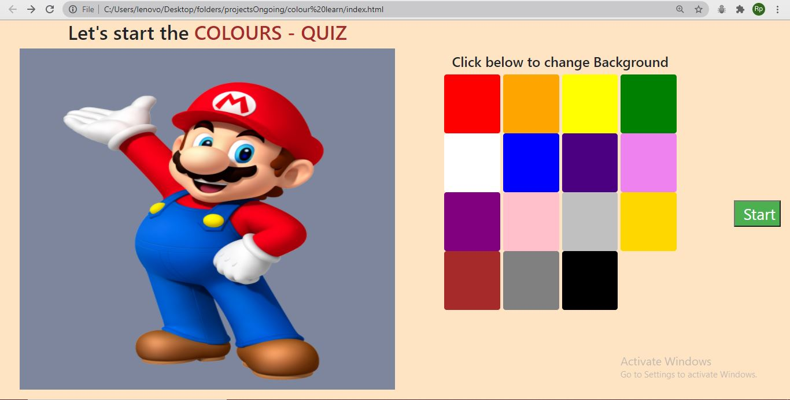
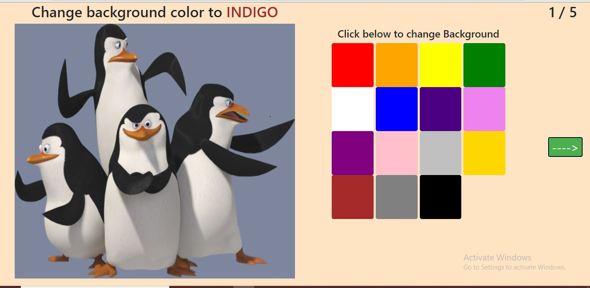
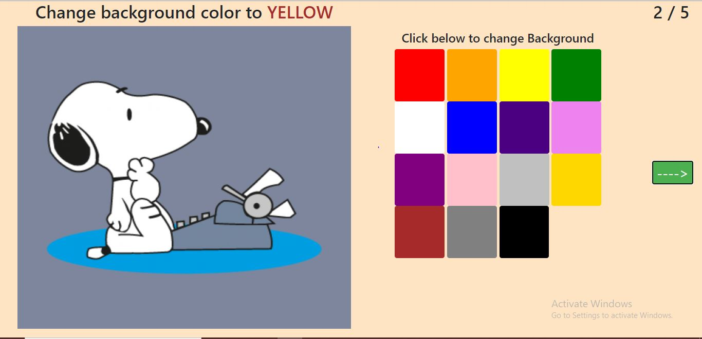
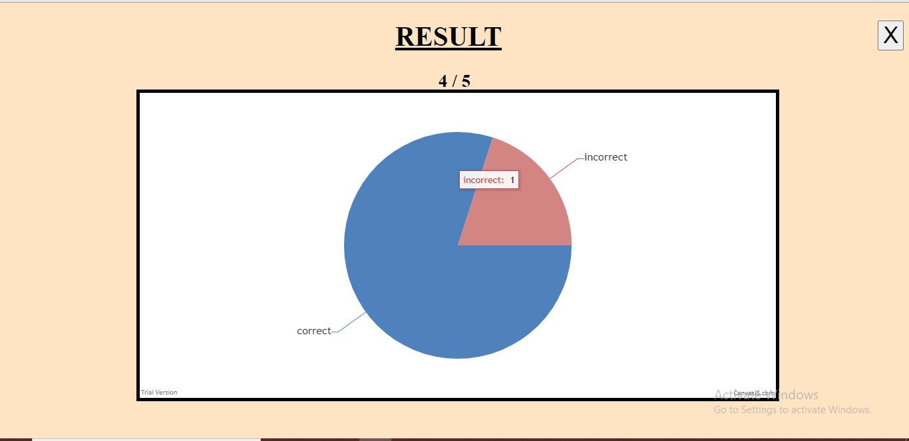

# Colours-Quiz

 

 

## About
<h3> Webapp for children of age 4 - 5 years to make learning colours interacitve and fun. </h3>

## Demo
|                  Entry Page                           |
| ------------------------------------------------------|
|      | 

|           Testcase 1                                      |               Testcase 2                                   |
| ----------------------------------------------------------|------------------------------------------------------------|
|          |           |

|                  Output Page                          |
| ------------------------------------------------------|
|     |

 

## Tools and Technologies used
*  HTML, CSS, Javascript

 

## Steps to run

* Fork and Clone the repository and Set it up locally  
* Open index.html file using browser and see it working 

 
